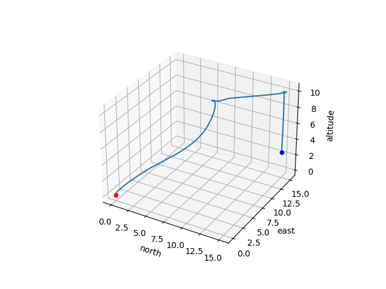
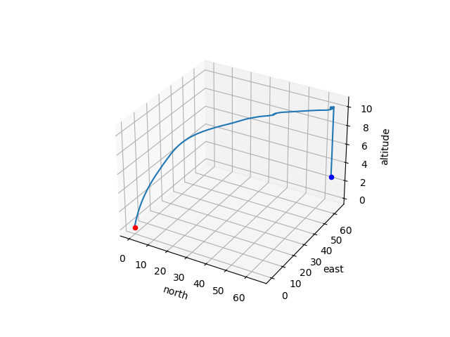
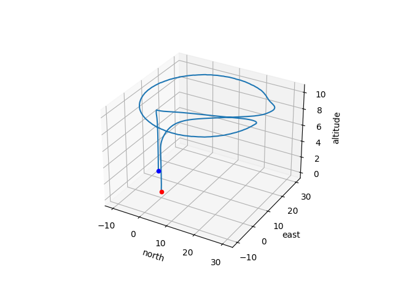
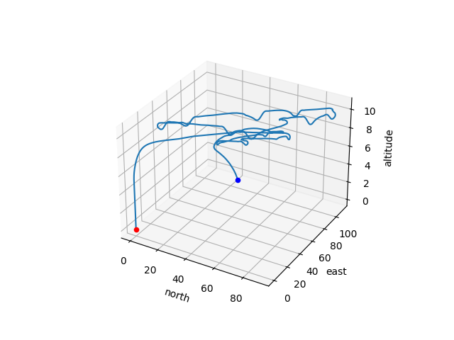
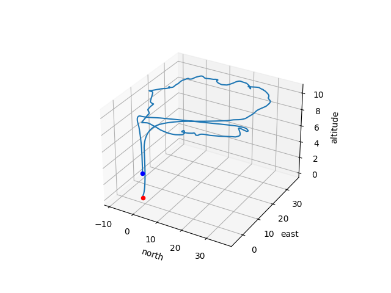

# **Report 2 - Marshall Thompson**

## Part 1 PX4

### Missions

#### Linear

#### Circular

### mp2_offboard_control

The file will be included in the same zip that this report is in. 

#### Implementation Details
The linear mission was straight forward. I first made it rise ten units into the air, and then move 5 units north and east, and then land.

For the circular mission, I started by making it fly upwards first. Then using sin/cos I computed the necessary points to make a circle of radius 20. The vehicle was instructed to move to each of those points.

### mp2.cpp

This file will be included in the same zip that this report is in.

## Part 2 Man in the Middle

### Description of Attacks Implemented
1) Fixed offset: For this attack, the coordinates we each adjusted by the same integer constant value. For example, with an offset of 1000 the new coordinates would be (x + 1000, y+1000). In my case the offset was 10.

2) Random offset: This attack is very similar to the fixed offset attack, however the constant is not fixed, its chosen randomly for each move the vehicle makes. This was done using the random library in Python. The random offset range was [10, 100]

3) Scale: This attack multiplies the coordinates by a fixed value c. So the new coordinates would be (x*c, y*c). I chose a negative value so that I could clearly see the change in values.

4) Flip: The flip attack is just swapping the x and y values. For example, if given the coordinates (x, y) it will return (y, x).

### Plots of Attacks

#### Linear

##### Offset

##### Random Offset

##### Scale

##### Flip

#### Circular

##### Offset 

##### Random Offset 

##### Random Offset (Range 10-20 for Clarity)

##### Scale

##### Flip

